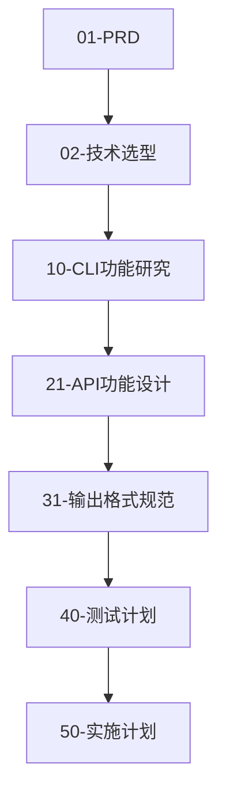

# 00-文档管理规范

**文档版本**: V1.0.0  
**创建日期**: 2024-01-15  
**最后更新**: 2024-01-15  
**负责人**: Claude Code Gateway Team  
**审核人**: 待定  
**状态**: ✅ 已完成

## 📋 文档概述

本文档定义了 Claude Code Gateway V1.0.0 项目的文档管理规范，采用**分包编号体系**确保文档按开发流程有序组织，易于查找和维护。

**管理目标**:
- 建立清晰的文档层次结构和编号体系
- 按项目阶段分包组织，便于管理和查找
- 确保文档质量和一致性
- 支持文档版本控制和协作

---

## 📁 分包目录结构

### 标准目录结构
```
docs/V1.0.0/                         # 版本根目录
├── 00-项目规划/                      # 阶段1: 项目规划
│   ├── 00-文档管理规范.md
│   ├── 01-项目需求文档(PRD).md
│   └── 02-技术选型流程.md
├── 10-需求研究/                      # 阶段2: 需求研究
│   ├── 10-Claude-CLI功能研究.md
│   ├── 11-竞品分析报告.md
│   └── 12-用户需求调研.md
├── 20-系统设计/                      # 阶段3: 系统设计
│   ├── 20-系统架构设计.md
│   ├── 21-Claude-Code原生API功能设计.md
│   ├── 22-LiteLLM兼容层设计.md
│   ├── 23-Web管理界面设计.md
│   └── 24-数据库设计.md
├── 30-技术规范/                      # 阶段4: 技术规范
│   ├── 30-API接口规范.md
│   ├── 31-CLI输出格式解析规范.md
│   ├── 32-错误处理规范.md
│   ├── 33-安全设计规范.md
│   └── 34-性能要求规范.md
├── 40-测试计划/                      # 阶段5: 测试计划
│   ├── 40-CLI输出格式完整测试计划.md
│   ├── 41-API功能测试计划.md
│   ├── 42-性能测试计划.md
│   └── 43-集成测试计划.md
├── 50-实施计划/                      # 阶段6: 实施计划
│   ├── 50-开发实施计划.md
│   ├── 51-部署方案.md
│   └── 52-监控运维方案.md
├── 60-运营文档/                      # 阶段7: 运营文档
│   ├── 60-用户使用手册.md
│   ├── 61-开发者集成指南.md
│   └── 62-故障排查手册.md
└── 90-附录/                         # 附录文档
    ├── 90-术语表.md
    ├── 91-参考资料清单.md
    └── 99-版本更新日志.md
```

---

## 🎯 编号体系规范

### 1. 分包编号规则
- **格式**: `[十位数]-[阶段名称]/`
- **编号**: 十位数，按开发阶段编号
- **间隔**: 每个阶段预留10个编号位（00-09, 10-19, ...）
- **扩展**: 新阶段使用下一个十位数段

### 2. 文件编号规则
- **格式**: `[编号]-[文档名称].md`
- **编号**: 两位数，在对应阶段编号段内
- **排序**: 按文档在阶段内的逻辑顺序编号
- **唯一性**: 整个项目内编号全局唯一

---

## 📊 文档状态管理

### 当前文档完成情况

#### 00-项目规划/ ✅ 完成度: 3/3 (100%)
| 编号 | 文档名称 | 状态 | 描述 |
|------|----------|------|------|
| **00** | 文档管理规范 | ✅ | 本文档，文档体系说明 |
| **01** | 项目需求文档(PRD) | ✅ | 项目概述、需求、目标 |
| **02** | 技术选型流程 | ✅ | 技术栈选择和决策依据 |

#### 10-需求研究/ ✅ 完成度: 1/3 (33%)
| 编号 | 文档名称 | 状态 | 描述 |
|------|----------|------|------|
| **10** | Claude-CLI功能研究 | ✅ | CLI完整功能特性分析 |
| **11** | 竞品分析报告 | ⏸️ | 类似产品的功能对比 |
| **12** | 用户需求调研 | ⏸️ | 目标用户访谈和需求收集 |

#### 20-系统设计/ ✅ 完成度: 1/5 (20%)
| 编号 | 文档名称 | 状态 | 描述 |
|------|----------|------|------|
| **20** | 系统架构设计 | ⏸️ | 整体系统架构和组件关系 |
| **21** | Claude-Code原生API功能设计 | ✅ | 原生API完整功能设计 |
| **22** | LiteLLM兼容层设计 | ⏸️ | OpenAI兼容API设计 |
| **23** | Web管理界面设计 | ⏸️ | 管理界面功能和UI设计 |
| **24** | 数据库设计 | ⏸️ | 数据模型和存储方案 |

#### 30-技术规范/ ✅ 完成度: 1/5 (20%)
| 编号 | 文档名称 | 状态 | 描述 |
|------|----------|------|------|
| **30** | API接口规范 | ⏸️ | 详细的API接口文档 |
| **31** | CLI输出格式解析规范 | ✅ | CLI输出的解析和转换规范 |
| **32** | 错误处理规范 | ⏸️ | 错误代码和异常处理标准 |
| **33** | 安全设计规范 | ⏸️ | 安全策略和权限控制 |
| **34** | 性能要求规范 | ⏸️ | 性能指标和优化要求 |

#### 40-测试计划/ ✅ 完成度: 1/4 (25%)
| 编号 | 文档名称 | 状态 | 描述 |
|------|----------|------|------|
| **40** | CLI输出格式完整测试计划 | ✅ | CLI所有输出格式的测试方案 |
| **41** | API功能测试计划 | ⏸️ | API接口的功能测试 |
| **42** | 性能测试计划 | ⏸️ | 性能和压力测试方案 |
| **43** | 集成测试计划 | ⏸️ | 端到端集成测试 |

#### 其他阶段 ⏸️ 待开始
- **50-实施计划/** - 0/3 (0%)
- **60-运营文档/** - 0/3 (0%)  
- **90-附录/** - 0/3 (0%)

### 整体完成度
**总体完成度**: 7/26 (约27%)

---

## 📝 文档编写规范

### 1. 文档头部信息模板
```markdown
# [编号]-[文档标题]

**文档版本**: V1.0.0  
**创建日期**: YYYY-MM-DD  
**最后更新**: YYYY-MM-DD  
**负责人**: [姓名]  
**审核人**: [姓名]  
**状态**: [草稿|审核中|已完成|已废弃]

## 📋 文档概述
[文档的目的、范围和主要内容概述]
```

### 2. 文档结构规范
- **统一标题层级**: ##, ###, #### 
- **目录索引**: 复杂文档包含导航目录
- **emoji图标**: 增强可读性和区分度
- **相关链接**: 建立文档间的关联引用

### 3. 状态标识规范
| 状态 | 图标 | 含义 |
|------|------|------|
| ✅ | 已完成 | 文档已完整编写并审核通过 |
| 🚧 | 进行中 | 文档正在编写或更新中 |
| ⏸️ | 待开始 | 计划中的文档，尚未开始编写 |
| ❌ | 已废弃 | 不再维护的文档 |
| 🔄 | 需更新 | 需要根据最新情况更新 |

### 4. 命名规范
- **包目录**: 使用中文，便于理解
- **文件名**: 中文，描述性强
- **链接**: 相对路径，确保可移植性
- **一致性**: 同类文档采用相似命名模式

---

## 🔗 文档关联关系

### 核心文档流程


### 跨包文档引用规范
```markdown
<!-- 同级包内引用 -->
[相关文档](./21-Claude-Code原生API功能设计.md)

<!-- 跨包引用 -->
[CLI功能研究](../10-需求研究/10-Claude-CLI功能研究.md)

<!-- Resource 引用 -->
[CLI研究资料](../../Resource/Claude-CLI-研究/README.md)
```

---

## 🎯 文档管理流程

### 1. 创建新文档流程
1. **确定所属阶段** - 选择合适的包目录
2. **分配编号** - 在阶段编号段内选择可用编号
3. **使用模板** - 基于Templates创建标准格式
4. **填写元信息** - 完整填写文档头部信息
5. **建立关联** - 添加与相关文档的链接
6. **更新索引** - 在本规范中记录新文档

### 2. 文档更新流程
1. **检查影响** - 确认更新对其他文档的影响
2. **更新内容** - 保持格式一致性
3. **更新元信息** - 修改版本号和更新日期
4. **验证链接** - 确保所有引用链接有效
5. **通知相关方** - 重要更新需要通知相关人员

### 3. 文档审核标准
- **内容准确性** - 技术内容无误，逻辑清晰
- **格式一致性** - 符合编写规范要求
- **完整性** - 包含必要的所有章节
- **关联性** - 文档间链接正确有效

---

## 📈 下一步计划

### 近期优先级 (1-2周)
1. 🚧 **20-系统架构设计** - 整体架构和组件设计
2. 🚧 **30-API接口规范** - 详细的API接口文档
3. 🚧 **50-开发实施计划** - 具体的开发计划和里程碑

### 中期计划 (3-4周)
1. 🚧 **22-LiteLLM兼容层设计** - OpenAI兼容性设计
2. 🚧 **32-错误处理规范** - 统一错误处理标准
3. 🚧 **41-API功能测试计划** - API测试方案

### 长期计划 (5-6周)
1. 🚧 **60-用户使用手册** - 面向用户的操作手册
2. 🚧 **61-开发者集成指南** - SDK和集成文档
3. 🚧 **90-术语表** - 项目术语标准化

---

## 🎯 质量保证

### 文档质量标准
- **准确性**: 技术内容准确无误
- **完整性**: 覆盖所需的所有信息点
- **一致性**: 格式、术语、风格统一
- **可用性**: 结构清晰，易于查找使用

### 定期维护机制
- **周检查**: 每周检查文档状态更新
- **月评审**: 每月评审文档质量和完整性
- **版本同步**: 确保文档与实际开发进度同步
- **过期清理**: 及时清理和归档过期文档

---

通过这个分包文档管理规范，Claude Code Gateway 项目的文档将保持**清晰有序、易于查找、便于维护**的状态，为项目成功交付提供坚实的文档基础！