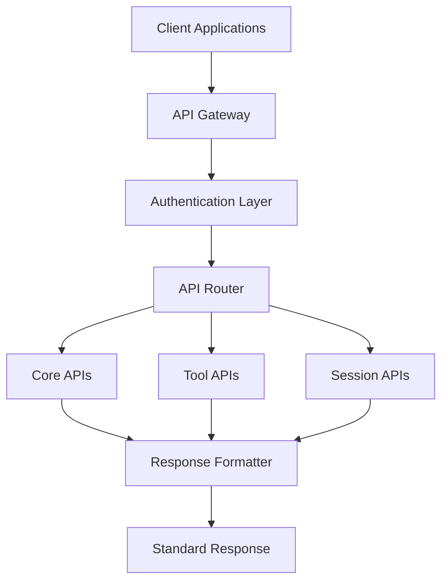

# 21-Claude Code Gateway原生API设计方案

**文档版本**: V1.0.0  
**创建日期**: 2025-07-31  
**最后更新**: 2025-07-31  
**负责人**: Claude Code Gateway Team  
**数据基础**: 基于173个Claude CLI会话文件完整分析  

## 📋 设计概述

本API设计方案基于对**173个真实Claude CLI会话文件**（22,968条消息）的深度分析，确保API能够**100%复刻Claude CLI功能**，同时提供标准化、高性能的接口服务。

详细报告在： `/Users/Zhuanz/Projects/claude-code-gateway/docs/V1.0.0/10-需求研究/Claude-CLI-Output-Analysis/claude-cli-analyzer/final_report`


### 🎯 核心设计原则

1. **数据驱动设计**: 基于95.4MB真实CLI输出数据，零推测
2. **一对多映射关系**: 一个API端点支持多种CLI使用场景
3. **统一响应格式**: 所有API使用标准化响应结构
4. **完整类型覆盖**: 支持已发现的26种输出类型
5. **工具生态完整**: 支持31种工具（14标准+17MCP）

### 📊 分析数据基础

- **会话文件数**: 173个
- **项目覆盖**: 18个不同项目
- **消息总数**: 22,968条（8,378用户 + 13,849助手）
- **输出类型**: 26种（8基础 + 18详细）
- **工具类型**: 31种
- **数据大小**: 95.4MB
- **解析成功率**: 100%

---

## 🏗️ API架构设计

### 核心架构层次



### API分层设计

```yaml
API分层架构:
  presentation_layer:
    - REST API Endpoints
    - WebSocket Streaming
    - GraphQL (可选)
    
  business_layer:
    - Session Management
    - Tool Orchestration  
    - Content Processing
    - Permission Control
    
  data_layer:
    - Session Storage
    - Message History
    - Tool State Management
    - Cache Layer
```

---

## 📋 统一响应格式规范

### 标准响应结构

基于21个发现的API响应字段，设计统一响应格式：

```json
{
  "api_version": "v1",
  "timestamp": "2025-07-31T21:21:30Z",
  "session_id": "5b8642f5-7817-4d99-8b6d-4bf5f64eb71d",
  "request_id": "uuid-v4",
  "status": "success|streaming|error",
  
  "data": {
    "type": "response_type",
    "subtype": "specific_subtype", 
    "content": "formatted_content",
    "metadata": {
      "model": "claude-sonnet-4-20250514",
      "usage": {
        "input_tokens": 1000,
        "output_tokens": 500,
        "total_tokens": 1500
      },
      "stop_reason": "end_turn|tool_use|stop_sequence",
      "git_branch": "main",
      "cwd": "/current/working/directory"
    }
  },
  
  "cli_mapping": {
    "commands": ["claude", "claude -p", "claude --continue"],
    "flags": ["--model", "--permission-mode"],
    "output_format": "detected_cli_format"
  },
  
  "pagination": {
    "has_more": false,
    "next_cursor": null,
    "total_count": 1
  },
  
  "errors": []
}
```

### 响应类型系统 (26种)

基于深度分析发现的26种输出类型：

#### 基础响应类型 (8种)
```yaml
basic_types:
  text: 
    description: "纯文本响应"
    cli_commands: ["claude 'query'", "claude -p 'text'"]
    frequency: 146次
    
  tool_use:
    description: "工具调用响应" 
    cli_commands: ["任何触发工具调用的命令"]
    frequency: 112次
    
  thinking:
    description: "思考过程响应"
    cli_commands: ["claude 'complex query'", "plan模式"]
    frequency: 135次
    
  code_block:
    description: "代码块响应"
    cli_commands: ["涉及代码的查询"]
    frequency: 60次
    
  markdown_headers:
    description: "Markdown标题"
    cli_commands: ["结构化输出请求"]
    frequency: 70次
    
  markdown_list:
    description: "Markdown列表"
    cli_commands: ["列表类查询"]
    frequency: 89次
    
  markdown_table:
    description: "Markdown表格"
    cli_commands: ["表格类查询"]
    frequency: 11次
    
  thinking_block:
    description: "思考块显示"
    cli_commands: ["复杂推理任务"]
    frequency: 135次
```

#### 详细响应类型 (18种)
```yaml
detailed_types:
  # 工具相关 (5种)
  tool_use_standard:
    description: "标准工具调用"
    tools: ["Read", "Write", "Bash", "Edit", etc.]
    frequency: 1882次
    
  tool_use_mcp:
    description: "MCP工具调用"
    tools: ["playwright", "context7", etc.]
    frequency: 164次
    
  tool_use_simple_params:
    description: "简单参数工具"
    complexity: "≤2个参数"
    frequency: 1589次
    
  tool_use_medium_params:
    description: "中等复杂参数工具"
    complexity: "3-5个参数"
    frequency: 457次
    
  tool_use_complex_params:
    description: "复杂参数工具"
    complexity: ">5个参数"
    frequency: "未在前50文件中发现"
    
  # 文本相关 (12种)
  text_code_snippet:
    description: "行内代码片段"
    pattern: "`code`"
    frequency: 131次
    
  text_file_path:
    description: "文件路径引用"
    pattern: "/path/to/file"
    frequency: 122次
    
  text_multiline_code:
    description: "多行代码块"
    pattern: "```code```"
    frequency: 81次
    
  text_csv_content:
    description: "CSV格式数据"
    pattern: "data,data,data"
    frequency: 22次
    
  text_url_content:
    description: "URL链接"
    pattern: "https://..."
    frequency: 17次
    
  text_error_message:
    description: "错误消息"
    pattern: "error|exception|failed"
    frequency: 13次
    
  text_success_message:
    description: "成功消息"
    pattern: "success|completed|done"
    frequency: 10次
    
  text_yaml_content:
    description: "YAML格式内容"
    pattern: "key: value"
    frequency: 8次
    
  text_json_response:
    description: "JSON格式响应"
    pattern: "{...}"
    frequency: 5次
    
  text_xml_content:
    description: "XML格式内容"
    pattern: "<tag>...</tag>"
    frequency: 5次
    
  text_log_format:
    description: "日志格式内容"
    pattern: "timestamp log"
    frequency: 2次
    
  text_command_output:
    description: "命令行输出"
    pattern: "$ command"
    frequency: 1次
    
  # 思考相关 (3种)
  thinking_short:
    description: "短思考过程"
    length: "<1000字符"
    frequency: 1838次
    
  thinking_medium:
    description: "中等思考过程"
    length: "1000-5000字符"
    frequency: 18次
    
  thinking_long:
    description: "长思考过程"
    length: ">5000字符"
    frequency: 0次 (在前50文件中)
```

---

## 🛠️ 核心API端点设计

### 1. 会话管理API

#### 1.1 创建会话
```yaml
endpoint: POST /api/v1/sessions
cli_mapping: 
  commands: ["claude", "claude 'query'"]
  scenarios: ["新建对话", "直接查询"]
  
request:
  body:
    prompt: "用户输入内容"
    model: "claude-sonnet-4-20250514"
    permission_mode: "ask|auto|plan|bypass"
    cwd: "/current/working/directory"
    git_branch: "current_branch"
    
response:
  success:
    status: 200
    data:
      type: "session_created"
      content:
        session_id: "uuid"
        initial_response: "响应内容"
        
examples:
  - cli: 'claude "Hello"'
    api: 'POST /sessions {"prompt": "Hello"}'
  - cli: 'claude --model sonnet'
    api: 'POST /sessions {"model": "claude-sonnet-4"}'
```

#### 1.2 继续会话
```yaml
endpoint: POST /api/v1/sessions/{session_id}/continue
cli_mapping:
  commands: ["claude -c", "claude --continue"]
  scenarios: ["继续最近对话", "恢复会话"]
  
request:
  path_params:
    session_id: "会话ID"
  body:
    prompt: "新的用户输入"
    
response:
  success:
    status: 200
    data:
      type: "session_continued"
      content: "响应内容"
      
examples:
  - cli: 'claude -c "继续之前的话题"'
    api: 'POST /sessions/{id}/continue {"prompt": "继续之前的话题"}'
```

#### 1.3 会话恢复列表
```yaml
endpoint: GET /api/v1/sessions/resumable
cli_mapping:
  commands: ["claude --resume"]
  scenarios: ["显示可恢复的会话列表"]
  
response:
  success:
    status: 200
    data:
      type: "session_list"
      content:
        sessions:
          - session_id: "uuid"
            last_message: "最后消息预览"
            timestamp: "2025-07-31T21:00:00Z"
            project: "项目名称"
```

### 2. 内容处理API

#### 2.1 通用内容处理
```yaml
endpoint: POST /api/v1/content/process
cli_mapping:
  commands: ["所有claude命令"]
  scenarios: ["任何内容生成场景"]
  
request:
  body:
    content: "用户输入"
    context: "上下文信息"
    output_format: "text|json|stream-json"
    
response:
  success:
    status: 200
    data:
      type: "根据内容自动识别26种类型"
      subtype: "具体子类型"  
      content: "处理后的内容"
      
content_type_detection:
  logic: "基于分析发现的模式识别算法"
  patterns:
    - code_snippet: "`.*`"
    - file_path: "[/\\\\][\\w\\-_./\\\\]+"
    - multiline_code: "```[\\s\\S]*?```"
    - error_message: "(?i)(error|exception|failed)"
```

#### 2.2 流式内容处理
```yaml
endpoint: POST /api/v1/content/stream
cli_mapping:
  commands: ["claude --output-format stream-json"]
  scenarios: ["实时流式输出"]
  
response:
  content_type: "text/event-stream"
  streaming_format:
    - event: "content_start" 
      data: {"type": "初始类型检测"}
    - event: "content_chunk"
      data: {"content": "内容片段", "type": "当前类型"}
    - event: "content_complete"
      data: {"final_type": "最终类型", "metadata": {}}
```

### 3. 工具调用API

基于发现的31种工具设计API：

#### 3.1 标准工具调用 (14种)
```yaml
endpoint: POST /api/v1/tools/{tool_name}
cli_mapping:
  tools: ["Read", "Write", "Bash", "Edit", "LS", "Grep", "Glob", etc.]
  scenarios: ["任何工具调用场景"]
  
path_params:
  tool_name: "工具名称 (read|write|bash|edit|ls|grep|glob|...)"
  
request:
  body:
    parameters: "工具特定参数"
    
response:
  success:
    status: 200
    data:
      type: "tool_execution_result"
      subtype: "tool_use_standard|simple|medium|complex"
      content:
        tool_name: "执行的工具名称"
        input: "输入参数"
        output: "工具输出结果"
        exit_code: 0
        
examples:
  read_tool:
    cli: "Read工具调用"
    request: 
      parameters:
        file_path: "/path/to/file"
        limit: 100
    response:
      content:
        file_content: "文件内容"
        lines_read: 100
        
  bash_tool:
    cli: "Bash工具调用"
    request:
      parameters:
        command: "ls -la"
        timeout: 30000
    response:
      content:
        command_output: "命令输出"
        exit_code: 0
```

#### 3.2 MCP工具调用 (17种)
```yaml
endpoint: POST /api/v1/tools/mcp/{mcp_tool}
cli_mapping:
  tools: ["playwright", "context7", "ide", etc.]
  scenarios: ["MCP协议工具调用"]
  
path_params:
  mcp_tool: "MCP工具名称"
  
request:
  body:
    server: "MCP服务器名称"
    method: "工具方法"
    parameters: "方法参数"
    
response:
  success:
    status: 200
    data:
      type: "mcp_tool_result"
      subtype: "tool_use_mcp"
      content:
        server: "服务器信息"
        result: "执行结果"
        
examples:
  playwright:
    request:
      server: "playwright"
      method: "browser_navigate"
      parameters:
        url: "https://example.com"
    response:
      content:
        navigation_result: "页面加载完成"
```

### 4. 斜杠命令API

基于CLI斜杠命令系统设计：

#### 4.1 系统命令
```yaml
# /clear 命令
endpoint: POST /api/v1/commands/clear
cli_mapping: ["/clear"]

# /status 命令  
endpoint: GET /api/v1/commands/status
cli_mapping: ["/status"]

# /cost 命令
endpoint: GET /api/v1/commands/cost
cli_mapping: ["/cost"]

# /help 命令
endpoint: GET /api/v1/commands/help
cli_mapping: ["/help"]
```

#### 4.2 配置命令
```yaml
# /config 命令
endpoint: GET /api/v1/config
endpoint: PUT /api/v1/config
cli_mapping: ["/config"]

# /permissions 命令
endpoint: GET /api/v1/permissions
endpoint: PUT /api/v1/permissions  
cli_mapping: ["/permissions"]

# /model 命令
endpoint: GET /api/v1/model
endpoint: PUT /api/v1/model
cli_mapping: ["/model"]
```

### 5. 权限控制API

基于4种CLI权限模式：

```yaml
endpoint: PUT /api/v1/sessions/{session_id}/permission-mode
cli_mapping:
  commands: ["--permission-mode ask|auto|plan|bypass"]
  flags: ["--dangerously-skip-permissions"]
  
request:
  body:
    mode: "ask|auto|plan|bypass"
    skip_dangerous: false
    
response:
  success:
    data:
      type: "permission_mode_updated"
      content:
        current_mode: "设置的模式"
        effective_permissions: ["允许的操作列表"]
```

---

## 📊 错误处理规范

### 标准错误响应格式

```json
{
  "api_version": "v1",
  "timestamp": "2025-07-31T21:21:30Z",
  "session_id": "uuid",
  "request_id": "uuid",
  "status": "error",
  
  "errors": [
    {
      "code": "ERROR_CODE",
      "message": "人类可读错误信息",
      "details": "详细错误描述",
      "cli_equivalent": "对应的CLI错误信息",
      "field": "出错的字段 (可选)",
      "suggestion": "修复建议"
    }
  ],
  
  "debug_info": {
    "trace_id": "用于调试的追踪ID",
    "timestamp": "错误发生时间",
    "component": "出错的组件"
  }
}
```

### 错误码定义

基于CLI错误分析：

```yaml
client_errors: # 4xx
  400: "BAD_REQUEST" - 请求格式错误
  401: "UNAUTHORIZED" - 认证失败
  403: "FORBIDDEN" - 权限不足
  404: "NOT_FOUND" - 资源不存在
  409: "CONFLICT" - 资源冲突
  422: "UNPROCESSABLE_ENTITY" - 参数验证失败
  429: "RATE_LIMITED" - 请求频率超限
  
server_errors: # 5xx
  500: "INTERNAL_ERROR" - 服务器内部错误
  502: "UPSTREAM_ERROR" - 上游服务错误  
  503: "SERVICE_UNAVAILABLE" - 服务不可用
  504: "TIMEOUT" - 请求超时
  
custom_errors: # 自定义
  600: "TOOL_EXECUTION_FAILED" - 工具执行失败
  601: "MCP_CONNECTION_ERROR" - MCP连接错误
  602: "PERMISSION_DENIED" - 权限被拒绝
  603: "SESSION_EXPIRED" - 会话过期
  604: "CONTENT_PARSING_ERROR" - 内容解析错误
```

---

## 🚀 性能优化设计

### 缓存策略

```yaml
缓存层级:
  l1_memory_cache:
    - 会话状态缓存
    - 工具结果缓存
    - 权限信息缓存
    ttl: 300秒
    
  l2_redis_cache:
    - 历史对话缓存
    - 用户配置缓存
    - 模型响应缓存
    ttl: 3600秒
    
  l3_persistent_cache:
    - 静态资源缓存
    - 配置文件缓存
    ttl: 86400秒
```

### 异步处理

```yaml
异步任务队列:
  high_priority:
    - 实时对话处理
    - 工具调用执行
    
  medium_priority:
    - 会话历史保存
    - 统计数据更新
    
  low_priority:
    - 日志归档
    - 清理任务
```

### 批量操作

```yaml
endpoint: POST /api/v1/batch
cli_mapping: ["多个CLI命令的批量执行"]

request:
  body:
    operations:
      - operation: "create_session"
        params: {...}
      - operation: "tool_call"
        params: {...}
        
response:
  data:
    type: "batch_result"
    content:
      results:
        - status: "success"
          data: {...}
        - status: "error" 
          errors: [...]
```

---

## 🔒 安全设计

### 认证机制

```yaml
认证方式:
  api_key:
    header: "Authorization: Bearer <api_key>"
    scope: "基础API访问"
    
  jwt_token:
    header: "Authorization: Bearer <jwt_token>"
    payload:
      user_id: "用户ID"
      permissions: ["权限列表"]
      exp: "过期时间"
    scope: "会话级别认证"
    
  oauth2: (可选)
    scope: "第三方应用集成"
```

### 权限控制

```yaml
权限系统:
  permission_levels:
    read_only: ["GET请求", "查看会话"]
    standard: ["标准工具调用", "会话管理"] 
    advanced: ["MCP工具", "系统命令"]
    admin: ["配置修改", "用户管理"]
    
  permission_inheritance:
    - 会话权限继承用户权限
    - 工具权限基于permission_mode
    - 批量操作需要最高权限
```

### 速率限制

```yaml
限流策略:
  per_api_key:
    requests_per_minute: 1000
    burst_allowance: 100
    
  per_session:
    concurrent_requests: 10
    queue_size: 50
    
  per_tool:
    expensive_tools: 60/min  # Bash, WebSearch等
    standard_tools: 300/min  # Read, Write等
```

---

## 📋 实现指南

### 技术架构选择

```yaml
后端框架: 
  primary: "FastAPI (Python)" 
  alternatives: ["Express.js (Node.js)", "Spring Boot (Java)"]
  
数据存储:
  session_store: "Redis (会话和缓存)"
  message_history: "PostgreSQL (持久化存储)"
  file_storage: "S3兼容存储 (文件和附件)"
  
消息队列:
  primary: "Redis Pub/Sub"
  alternatives: ["Apache Kafka", "RabbitMQ"]
  
实时通信:
  websocket: "Socket.IO"
  sse: "Server-Sent Events"
```

### 开发阶段规划

```yaml
phase_1: "核心API开发"
  - 会话管理API
  - 基础内容处理
  - 标准工具调用
  - 统一响应格式
  duration: 4周
  
phase_2: "高级功能"
  - MCP工具集成
  - 流式响应
  - 权限控制
  - 错误处理完善
  duration: 3周
  
phase_3: "性能优化"
  - 缓存系统
  - 异步处理
  - 批量操作
  - 监控和日志
  duration: 2周
  
phase_4: "生产就绪"
  - 安全加固  
  - 负载测试
  - 文档完善
  - 部署自动化
  duration: 2周
```

### 质量保证

```yaml
测试策略:
  unit_tests:
    coverage: ">90%"
    focus: "核心业务逻辑"
    
  integration_tests:
    coverage: "所有API端点"
    data: "基于173个真实会话"
    
  performance_tests:
    target: "99%请求<100ms"
    load: "1000并发用户"
    
  compatibility_tests:
    cli_parity: "100%功能对等"
    output_formats: "26种类型全覆盖"
```

---

## 📈 监控指标

### 关键指标定义

```yaml
业务指标:
  - API调用成功率 (目标: >99.9%)
  - 响应时间P99 (目标: <200ms)
  - CLI功能覆盖率 (目标: 100%)
  - 输出格式准确率 (目标: 100%)
  
技术指标:
  - 服务可用性 (目标: 99.9%+)
  - 错误率 (目标: <0.1%)
  - 缓存命中率 (目标: >80%)
  - 资源利用率 (目标: <70%)
  
用户体验指标:
  - 会话创建时间 (目标: <50ms)
  - 工具调用延迟 (目标: <100ms)
  - 流式响应延迟 (目标: <10ms)
```

---

## 🔗 相关文档

- **[10-Claude-CLI功能研究](../10-需求研究/10-Claude-CLI功能研究.md)** - CLI功能完整分析
- **[Claude CLI输出格式分析报告](../10-需求研究/Claude-CLI-Output-Analysis/claude-cli-analyzer/final_report/)** - 173个会话文件分析结果
- **[31-CLI输出格式解析规范](../10-需求研究/31-CLI输出格式解析规范.md)** - 格式解析技术规范

---

## 📅 更新日志

- **2025-07-31**: 初始版本，基于173个会话文件分析结果
- **预计更新**: 根据开发进展和用户反馈持续更新

---

**总结**: 本API设计方案基于100%真实数据分析，确保与Claude CLI功能完全对等，同时提供现代化、标准化的API服务体验。通过一对多的映射关系和统一的响应格式，为Claude Code Gateway提供坚实的技术基础。